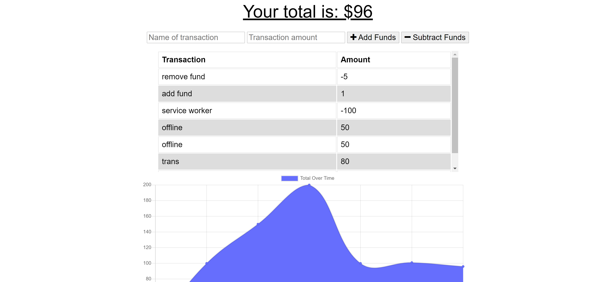

# pwa-budget-tracker     

## Description

This application is a PWA, aka Progressive Web Application! This application functions in the browser and can also function offline. The application is also downloadable to a user's machine, whether it be a desktop or a mobile phone! This app uses a MongoDB and Express.js backend. It also uses a service worker and IndexedDB to prodive seamless functionality.

## Installation

You can use the site on the web and in the url bar you will also be able to download the application to your desktop!
     
## Application

[Use the Budget Tracker!](https://glacial-coast-25788.herokuapp.com/)
